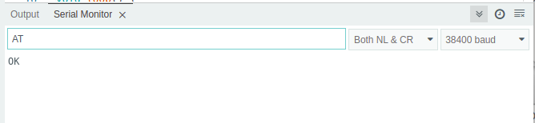
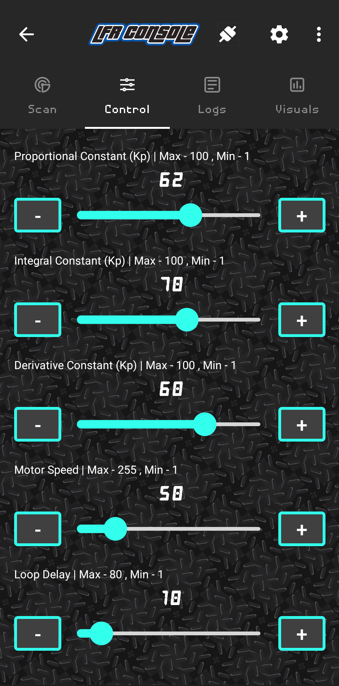

<p align="center">

</p>
<p align="center">

</p>
<p align="center">

</p>

## LFR Console 🤖

> For the Roboticists, By the roboticists

As the name suggests, LFR Console is an android app that interfaces with a Line Follower Robot over
bluetooth with the LFR connected to an HC-05 module.

### Features Include

- ⚡ Low latency, small range wireless connectivity over Bluetooth.
- 📃️ Wireless logging with 4 verbosity levels
- ⏯️ Play or Pause Logging to enable precise debugging
- 🎛️ Realtime publish of new PID tuning parameters using user friendly app widgets (seekbar)
- 1️⃣0️⃣ Digital Line Sensor data visualization (8 & 12 channel)
- 📊 Analog Line Sensor data visualization (only 8 channel)
- 📈 variable wireless Serial Plotter
- 🎮 Easy Scan -> Connect -> Play experience.

### HC-05 AT configuration for compatibility with the app

#### schematics

Connect the HC-05 bluetooth module with an arduino uno ( nano or mega ) as shown in the image below
<p align="center">
    
</p>

<p align="center">
    
</p>

Right before powering the Bluetooth module, make sure to keep the button (as shown in the image
above) pressed for at least 3 seconds right after powering up the module.This will make the HC-05
enter into AT command mode. The Red LED on the HC-05 shall toggle every two seconds when entering
the AT command mode.

#### Code

Follow these steps to configure your HC-05

- Disconnect the Rx Tx pins from the arduino board.
- Upload a blank arduino sketch to the arduino board as shown below :

```
// Blank sketch 
void setup() {}
void loop() {}
```

- Reconnect the Rx Tx pins back to the arduino and open the Serial monitor.
- Set the Baud rate to ``38400`` and enable ``NL & CR`` for Newline and Carriage return, as shown
  below :

<p align="center">
    
</p>

This shall append ``'\n\r'`` at the end of every message entered in the Serial Monitor. This makes
the HC-05 parse the AT commands effectively.

- Upon writing ``AT`` in the Serial Monitor input and pressing enter, an ``OK`` should be printed
  back on the Serial monitor as follows :

<p align="center">
    
</p>
This shall mean that everything is working fine.
A List of AT commands for configuring an HC-05 can be availed [here](https://s3-sa-east-1.amazonaws.com/robocore-lojavirtual/709/HC-05_ATCommandSet.pdf)

- Following the are the list of AT commands to configure the HC-05
    - ``AT+UART=115200,0,0`` (**important**) to set the baud rate of the HC-05 module to 115200 and
      LFR console operates at this baud rate.
    - ``AT+ROLE=0`` (**important**) to set the device in Slave mode.
    - ``AT+NAME=<DEVICE_NAME>`` (**optional**) to give a unique name identifier for the HC-05
      module.
    - ``AT+PSWD=<4-DIGIT_NUMERIC_PIN>`` (**optional**) to override the default pin **1234**.

### Send log messages from the MCU

Now that the HC-05 is configured, connecting it to the app is no rocket science. Simply scan and
connect to this device by the following the steps prompted by the app.

Sending log messages from the arduino to the app does not require an additional framework or a
library to be installed. A simple ``Serial.println()`` call does the job, except the message needs
to start with any one of ``I``, ``V``, ``D`` and ``E`` followed by a pipe ``|``.

For sending a log message use the following message format :

````
Serial.println(<V, I, W, E>|<Your message here>);
````

The app currently supports 4 levels of verbosity in ascending order of priority :

- ``V`` - *Verbose* level (texts are coloured white)
- ``I`` - *Info* level (texts are coloured in green)
- ``W`` - *Warning* level (texts are coloured in yellow)
- ``E`` - *Error* level (texts are coloured in red)

Example :
For logging 8 channel sensor data in *Verbose* level (white coloured text)

```C++
#include<string.h> // required for sprintf

// Since most mcus have multiple serial ports, the following definition can be modified 
// to use a different serial sort e.g #define BLUETOOTH_SERIAL Serial1
#define BLUETOOTH_SERIAL Serial 

// inside the function that reads the sensor values
uint8_t s1 = digitalRead(S1);
uint8_t s2 = digitalRead(S2);
uint8_t s3 = digitalRead(S3);
uint8_t s4 = digitalRead(S4);
uint8_t s5 = digitalRead(S5);
uint8_t s6 = digitalRead(S6);
uint8_t s7 = digitalRead(S7);
uint8_t s8 = digitalRead(S8);

// The following block will be conpiled only when the  BLUETOOTH_LOGGING_ENABLED is defined as 1
#if BLUETOOTH_LOGGING_ENABLED == 1
	char ss[16];
	sprintf(ss, "%d%d%d%d%d%d%d%d", s1, s2, s3, s4, s5, s6, s7, s8);
	BLUETOOTH_SERIAL.print("V|Sensor Reading : ");
	BLUETOOTH_SERIAL.println(String(ss));
#endif
```

**Note**
The app considers ``\n`` (newline character) as the line separator. Take the previous code snippet
for example, Multiple ``Serial.print()`` calls followed by a single ``Serial.println()`` is
considered as a single line in the lfr console app.

> Currently the app does not include the feature to filter log messages based on verbosity levels
> but this will be added in the upcoming update

### Send digital and analog sensor data for visualization (8 channels)

The application uses json as the message format for communication, except for the logs messages.
Hence the app expects the digital sensor data (for visualization) in the json format. Hence the
sensor data should be presented in the following json format before sending it from arduino to the
app.

```json
{
  "an": [
    10,
    12,
    11,
    96,
    95,
    10,
    12,
    11
  ],
  "di": "00000000",
  "v1": 12.0,
  "v2": 5.0,
  "v3": 64.0,
  "l1": "Label 1",
  "l2": "Label 2",
  "l3": "Label 3"
}
```

As can be seen from above, the data for digital values, analog values and 3 variable serial plotter
is sent to the app in the single message. However, the app allows the above message to be received
in parts as shown below in the following json message, that updates the visuals only for digital
sensor values :

```json
{
  "di": "00000000"
}
```

The above message only sends data to visualize the digital sensors.

```json
{
  "an": [
    10,
    12,
    11,
    96,
    95,
    10,
    12,
    11
  ]
}
```

Similarly, messages can include data to visualize only the analog sensors.

```json
{
  "v1": 12.0,
  "v2": 5.0,
  "v3": 64.0,
  "l1": "Label 1",
  "l2": "Label 2",
  "l3": "Label 3"
}
```

The above message only utilizes the Serial plotter in the app for three values. It's important to
note that it is not necessary to send all the three values together. In the context of the above
json format, it is possible to only send a single value for example :

```json
{
  "l1": "Label 1"
}
```

Data can be **serialized** into JSON string using the ``sprintf()`` function in C, but we may need a
different approach to deserialize incoming json string from the app, in an arduino. Hence it is
recommended to use a library that helps us deal with json **serialization** and **deserialization**.

The [ArduinoJson](https://github.com/bblanchon/ArduinoJson) library is the go to library for
developers when it comes to dealing with json strings and objects in arduino. The guide to
installing this library in the *arduino IDE* can be
found [here](https://arduinojson.org/v6/doc/installation/)

#### Send digital sensor data

Following is the code snippet to produce the json string shown in the previous snippets :

```C++
#include <ArduinJson.h>
#include <string.h>

// determine the right size for your json objects consider using this tool that helps 
// in calculating required the size for the json object. 
// https://arduinojson.org/v6/assistant/#/step1

#define TX_DOC_MAX_DATA_LEN 192
#define BLUETOOTH_SERIAL Serial

...

void readSensors() {
  
  ...
   
  uint8_t s1 = digitalRead(S1);
  uint8_t s2 = digitalRead(S2);
  uint8_t s3 = digitalRead(S3);
  uint8_t s4 = digitalRead(S4);
  uint8_t s5 = digitalRead(S5);
  uint8_t s6 = digitalRead(S6);
  uint8_t s7 = digitalRead(S7);
  uint8_t s8 = digitalRead(S8); 
  
  char ss[16];    // allocate a buffer to store the sensor data as a string like : "00000000"
  char output[TX_DOC_MAX_DATA_LEN]; // allocate the buffer for the JSON object
  sprintf(ss, "%d%d%d%d%d%d%d%d", s1, s2, s3, s4, s5, s6, s7, s8);  // print the sensor data to a string
  txDoc["di"] = String(ss);   // populate the "di" field with the sensor data string
  serializeJson(txDoc, output);   // convert the json object to json string.
  BLUETOOTH_SERIAL.println(output);   // print this serialized data to Serial (Bluetooth) make sure to use the 'println()' function here
  
  ...
  
}

...

```

For more information on ArduinoJson, follow the
detailed [documentation](https://arduinojson.org/v6/doc/) by the author himself.

#### Send analog sensor data

To be documented soon.

### Send digital and analog sensor data for visualization (12 channels)

#### Send digital sensor data

Sending sensor data for 12 channel line sensor array is pretty much similar as for 8 channels,
However with a minor difference as shown in the snippet below :

```C++
#include <ArduinJson.h>
#include <string.h>

// determine the right size for your json objects consider using this tool that helps 
// in calculating required the size for the json object. 
// https://arduinojson.org/v6/assistant/#/step1

#define TX_DOC_MAX_DATA_LEN 192 
#define BLUETOOTH_SERIAL Serial

...

void readSensors() {
  
  ...
  
  uint8_t s1 = digitalRead(S1);
  uint8_t s2 = digitalRead(S2);
  uint8_t s3 = digitalRead(S3);
  uint8_t s4 = digitalRead(S4);
  uint8_t s5 = digitalRead(S5);
  uint8_t s6 = digitalRead(S6);
  uint8_t s7 = digitalRead(S7);
  uint8_t s8 = digitalRead(S8);
  uint8_t s9 = digitalRead(S9);
  uint8_t s10 = digitalRead(S8);
  uint8_t s11 = digitalRead(S8);
  uint8_t s12 = digitalRead(S8);
  
  char ss[16];    // allocate a buffer to store the sensor data as a string like : "000000000000"
  char output[TX_DOC_MAX_DATA_LEN]; // allocate the buffer for the JSON object
  sprintf(ss, "%d%d%d%d%d%d%d%d%d%d%d%d", s1, s2, s3, s4, s5, s6, s7, s8, s9, s10, s11, s12);  // print the sensor data to a string
  txDoc["di"] = String(ss);   // populate the "di" field with the sensor data string
  serializeJson(txDoc, output);   // convert the json object to json string.
  BLUETOOTH_SERIAL.println(output);   // print this serialized data to Serial (Bluetooth) make sure to use the 'println()' function here
  
  ...
  
}

...

```

#### Send analog sensor data

To be documented soon.

### Send Serial Plotter data for up to 3 variables

To be documented soon.

### Receive PID tuning params from the app in the microcontroller.

The LFR console android app has 5 slider widgets for :

- Proportional constant
- Integral constant
- Derivative constant
- Motor speed
- loop delay (derivative delay)

<p align="center">
    
</p>

Data is sent only when the user stops sliding and releases contact from it. Data is sent for all the
sliders. For example, when the proportional constant's slider is released by the user, the values of
all the 5 sliders are sent from the app. The values are sent in the following json format :

```json
{
  "P": 12,
  "I": 1,
  "D": 60,
  "ms": 130,
  "de": 8
}
```

where :

- *"P"* is for **Proportional Constant (Kp)**,
- *"I"* is for **Integral Constant (Ki)**,
- *"D"* is for **Derivative Constant (Kd)**
- *"ms"* is for **Motor Speed**
- *"de"* is for **Loop Delay (or Derivative Delay)**

This json string is expected to be received a single line, over the Serial, in the arduino, hence
the following code snippet can be used to parse the incoming json string and extract the values.

```C++
#include <string.h>
#include <ArduinoJson.h>

#define RX_DOC_MAX_DATA_LEN 64
#define BLUETOOTH_SERIAL Serial

#define DEFAULT_LOOP_DELAY 6
#define DEFAULT_KP 7
#define DEFAULT_KI 0
#define DEFAULT_KD 40
#define DEFAULT_MOTOR_SPEED 80

int Kp = DEFAULT_KP;
int Ki = DEFAULT_KI;
int Kd = DEFAULT_KD;
int baseMotorSpeed = DEFAULT_MOTOR_SPEED;
int loopDelay = DEFAULT_LOOP_DELAY;

...

void setup() {
    ...
    BLUETOOTH_SERIAL.begin(115200); // important to set this baud rate
    ...
}

void loop () {
    ...
    if (BLUETOOTH_SERIAL.available()) 
    {
		BLUETOOTH_SERIAL.flush();
		String data = BLUETOOTH_SERIAL.readStringUntil('\n');
		DeserializationError error = deserializeJson(rxDoc, data);
		if (error)
		{
			BLUETOOTH_SERIAL.print("E|deseriaize json failed : ");
			BLUETOOTH_SERIAL.println(error.f_str());
			return;
			rxDoc.clear();
		}
		Kp = rxDoc["P"];			  // 0
		Ki = rxDoc["I"];			  // 0
		Kd = rxDoc["D"];			  // 0
		baseMotorSpeed = rxDoc["ms"]; // 255
		loopDelay = rxDoc["de"];	  // 100
		rxDoc.clear();
	}
	...
}

...

```

### Upcoming features

The LFR console app currently includes quite a few [utilitarian features](#features-include). However the following shall be added in the upcoming update :

- **Ability to connect to multiple devices** : The app currently supports connection with a single device at a time. 
The upcoming update shall include the ability to maintain bluetooth connections with multiple devices simultaneously. 


- **Filter log messages** : For a better debugging experience, filtering log messages helps in diagnosing potential problems with an ease. 
Hence will be implemented in the upcoming updates.


- **BLE support** : The app currently uses Bluetooth classic to enable connectivity with HC-05 which solely use Bluetooth classic. 
However, to support a wide range of bluetooth modules, BLE (Bluetooth Low Energy or Bluetooth 4.2+) connectivity shall be incorporated in the future updates.

### About Hyper Drive Community

Hyper Drive is a community of like-minded robotics enthusiasts who aim to guide and motivate young engineers in building and breaking barriers to create new robots.

We as community organizers, offer guidance in building autonomous bots and resources, such as articles, discussions, and expert mentorship, to those struggling to make their robots work.
HyperDrive\'s philosophy is centered around the idea of technology as a sport.We aim to bring together a diverse community of innovators, engineers, inventors, enthusiasts, and competitors under one roof.

We are passionate about motivating young engineers to create new robots, break through barriers, and strive for excellence in competition.
Join us today and discover the endless possibilities of robotics. 
No prior experience is necessary, and we welcome all levels of enthusiasts who share our commitment to learning and enthusiasm for engineering. HyperDrive is an initiative to provide you with what we never had during our time, 
and we invite you to be part of this exciting journey.

<br/>

<div align="center">  
  <a 
    href="https://t.me/hyperdrivehd" style="
    display: inline-flex;
    flex-direction: row;
    align-items: center;
    background: #2AABEE;
    font-size: 18px;
    padding: 0.5rem 1rem;
    border-radius: 0.5rem;
    text-decoration: none;
    color: #FFFFFF;
    font-family: Helvetica, sans-serif;">
        
        Click here to join HyperDrive Telegram Group
    </a>
</div>

### Author

<div style="
    display: flex; 
    flex-direction: row;
    align-items:center;">
    
    <div style="margin-left: 1.2rem;">
        <p style="
                font-size: 1.5rem;
                margin: 0 0;">
            Pratik Gupta
        </p>
        <p style="
                font-size: 0.9rem;
                margin: 0 0;
                margin-top: 0.3rem;
                font-family: Helvetica, sans-serif;">
            rgrgupta1148@gmail.com
        </p>
        <p style="
                margin: 0 0;
                margin-top: 0.3rem;
                font-size: 0.9rem;
                font-family: Helvetica, sans-serif;">
            I Build mobile and web apps for a living and robots for fun !
        </p>
    </div>
</div>

<br/>
<br/>
<br/>


